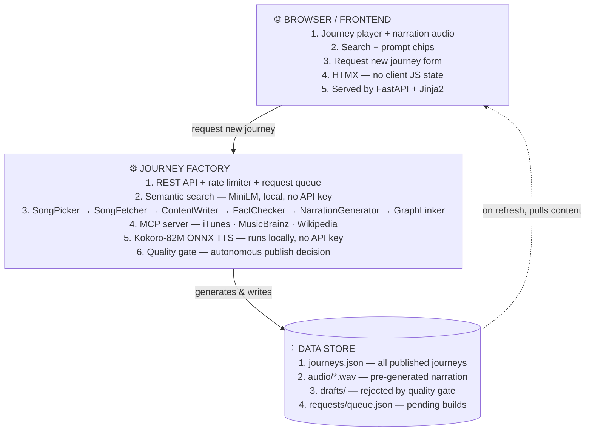

# Sonic Rabbit

Curated music history "podcast" journeys — each one is a narrated, chronological sequence of 6–10 songs on a shared theme, where a voice guides the listener through context before each song plays.

Built for the **Kaggle "Agents for Good"** competition using Google ADK.

---

## What it does

You pick a topic — gospel and soul, the Great Migration, women who rewrote music history — and Sonic Rabbit plays it back like a mini podcast: intro narration, then song 1 narration → 30-second preview → song 2 narration → preview → ... → closing narration. At the end you get a downloadable playlist with deep links to Spotify, Apple Music, and YouTube.

The app also learns what's missing. When a search finds nothing, it shows an honest "we don't have that yet" and lets you request it. A classifier validates the request, queues it, and the full pipeline builds it autonomously — no human in the loop.

---

## Architecture



The web runtime needs no Gemini API key at serve time. All content and audio is pre-generated by the pipeline. The only runtime AI is MiniLM for semantic search — local, no network, no cost.

---

## Agent system

| Agent | Type | Role |
|-------|------|------|
| **SongPicker** | `LlmAgent` | theme → ranked candidate list (over-generates so fetcher can screen) |
| **SongFetcher** | `LlmAgent` + MCP | resolves `preview_url`, `image_url`, `streaming_links` per song |
| **ContentWriter** | `LlmAgent` | writes journey intro, per-song blurbs, closing paragraph |
| **FactChecker** | `LlmAgent` + MCP | verifies recording date/place via MusicBrainz + Wikipedia |
| **NarrationGenerator** | code | Kokoro-82M ONNX TTS → WAV files, no API key |
| **GraphLinker** | `LlmAgent` | quality gate: counts missing previews/audio, decides whether to publish |

The orchestrator (`pipeline/run.py`) is deterministic Python code driving the agents via Google ADK `Runner`.

## MCP server

`src/music_journey/mcp_music/server.py` exposes three tools:

| Tool | Source | Used by |
|------|--------|---------|
| `search_track(title, artist)` | iTunes → Deezer fallback | SongFetcher |
| `verify_recording(title, artist)` | MusicBrainz | FactChecker |
| `search_wikipedia(query)` | Wikipedia | FactChecker |

Preview URLs are **never LLM-generated** — they come from MCP tool results only.

## Quality gate

The GraphLinker autonomously decides whether to publish. Criteria (all must pass):
- ≥ 5 songs total
- 0 songs missing a preview URL (every song needs audio)
- Narration audio present for at least half the songs

If rejected: journey JSON saved to `data/drafts/` for inspection, quality report written to `data/review/`.

## Discovery

Three-tier discovery system:

1. **Rung 1 — Prompt chips**: hand-curated chips ("Take me to church", "Music that meant something bigger") → direct journey routing. Zero cost.
2. **Rung 2 — Semantic search**: MiniLM cosine match at startup, ~10ms per query, no API key. Finds "sad protest songs" even if the journey is called "It Started With a Choir."
3. **Rung 3 — Honest miss + request**: when nothing matches, shows "we don't have that yet" + request form. Classifier (Gemini, 1 call) validates the request, enqueues it, and the pipeline builds it in the background.

## Request new journey

User submits a title + description. The backend:
1. Rate-limits to 3 requests per IP per 24 hours
2. Runs a semantic duplicate check (MiniLM, score ≥ 0.65 = duplicate)
3. Sends one Gemini call to detect spam/prank and assign a category
4. If valid: adds to `data/requests/queue.json`, returns "check back in a few hours"
5. Background asyncio worker processes the queue (one at a time, polls every 60s), runs the full pipeline, publishes if it passes the quality gate

---

## Setup

**Requirements:** Python 3.11+, [uv](https://github.com/astral-sh/uv), a `GEMINI_API_KEY` in your environment (pipeline only — not needed to run the web server).

```bash
# Install arm64 uv (macOS M-series)
curl -LsSf https://astral.sh/uv/install.sh | sh

# Clone and sync
git clone <repo>
cd music_journey_capstone
uv sync --extra discovery

# Run the web server (no API key needed)
uv run uvicorn src.music_journey.api.main:app --reload
# → http://127.0.0.1:8000
```

```bash
# Run tests
uv run pytest -q

# Run the content pipeline (requires GEMINI_API_KEY)
export GEMINI_API_KEY=your_key_here
uv run python -m music_journey.pipeline.run --theme "songs about exile"
```

**First pipeline run:** Kokoro TTS downloads ~85MB model on first call, cached to `~/.cache/music_journey/`.

**HuggingFace token (optional):** set `HF_TOKEN` in your environment to avoid rate limits on the Kokoro model download.

---

## Data layout

```
data/
├── journeys.json          # content store (all published journeys)
├── audio/{journey_id}/    # pre-generated WAV narration files
│   ├── intro.wav
│   ├── outro.wav
│   └── song_01.wav … song_N.wav
├── drafts/                # pipeline-rejected journeys (quality gate failed)
├── review/{journey_id}.json  # quality report per journey
└── requests/queue.json    # user-submitted journey requests
```

---

## Current journey library

| Journey | Songs | Theme |
|---------|-------|-------|
| It Started With a Choir | 7 | Gospel → soul → funk: how church music went secular |
| What the South Sent North | 8 | The Great Migration and Black American music |
| Every Song Has a Sole | 8 | Shoes as a musical object across six decades |
| Turns Out Women Had Opinions | 8 | Women's voices rewriting music from the inside |
| Your Favorite Song Has a Passport | 7 | Eastern sounds absorbed into Western pop |
| Nobody Planned This | 7 | Musical collisions nobody could have scripted |

---

## Tech stack

| Layer | Choice |
|-------|--------|
| Runtime agents | Google ADK (`google-adk`) |
| LLM | `gemini-2.5-flash` via LiteLLM |
| TTS | Kokoro-82M ONNX (local, no API key, arm64) |
| MCP tools | iTunes, Deezer, Wikipedia, MusicBrainz |
| API | FastAPI 0.115 |
| Frontend | Jinja2 + HTMX (no client JS state) |
| Search | `sentence-transformers` MiniLM-L6-v2 (local) |
| Data | `data/journeys.json` (flat JSON, repository pattern) |
| Tests | pytest, 76 tests |
