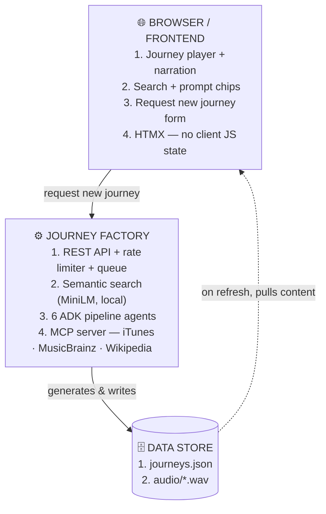

# Architecture

```mermaid
flowchart TD
    FE["🌐 BROWSER / FRONTEND
    1. Journey player + narration
    2. Search + prompt chips
    3. Request new journey form
    4. HTMX — no client JS state"]

    JF["⚙️ JOURNEY FACTORY
    1. REST API + rate limiter + queue
    2. Semantic search (MiniLM, local)
    3. 6 ADK pipeline agents
    4. MCP server — iTunes · MusicBrainz · Wikipedia"]

    DB[("🗄️ DATA STORE
    1. journeys.json
    2. audio/*.wav")]

    FE -->|request new journey| JF
    JF -->|generates & writes| DB
    DB -.->|on refresh, pulls content| FE
```
